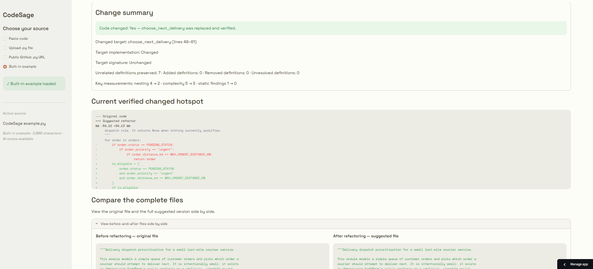
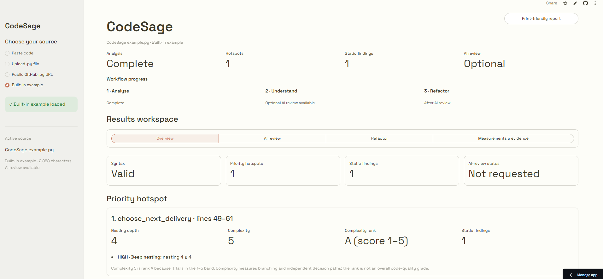
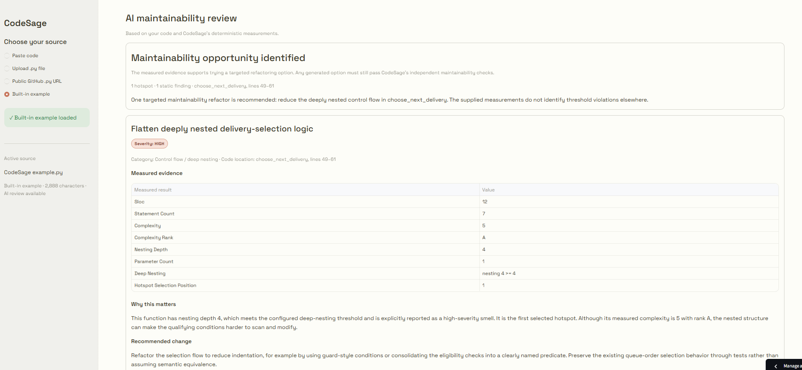
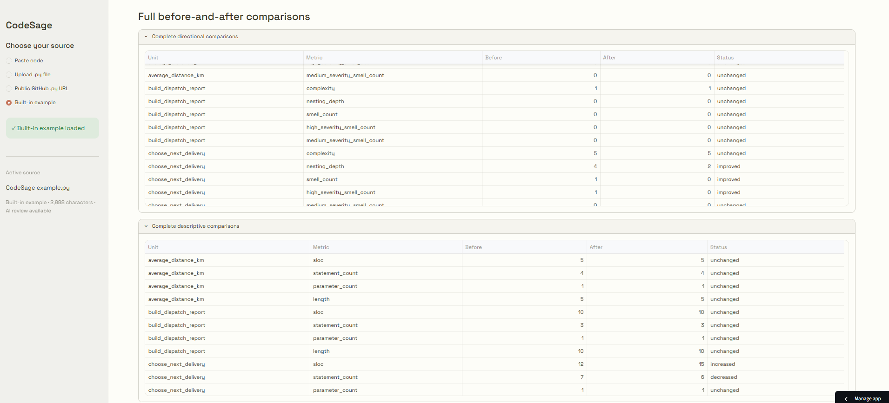
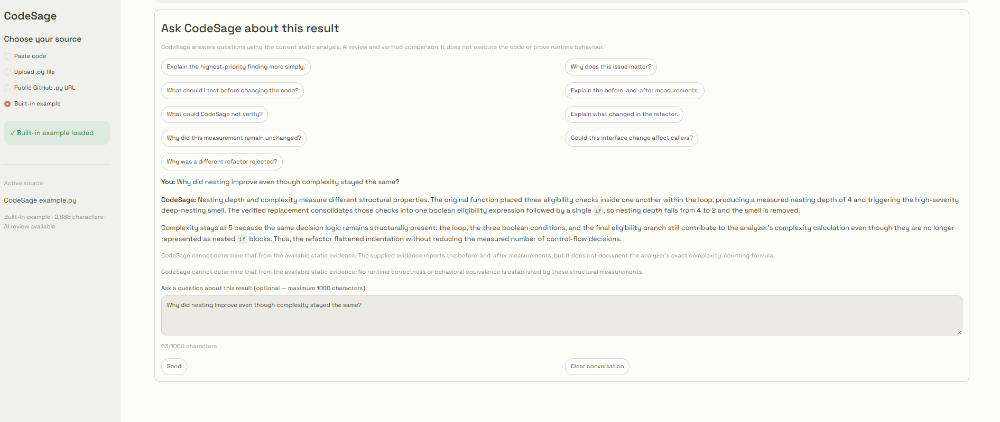
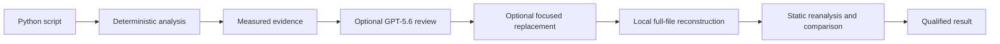

<div align="center">

# CodeSage

<h2>Your Python maintainability coach</h2>

Find maintainability hotspots, understand the measured evidence, and explore a focused refactor without executing your code.

<p>
  <a href="https://codesage-maintainability.streamlit.app/"></a>
  
  
  <a href="LICENSE"></a>
</p>

**[Try the live app](https://codesage-maintainability.streamlit.app/)** · **OpenAI Build Week: Developer Tools**

<blockquote>
  <p><strong>🎥 Demo video:</strong> coming soon</p>
  <p>A short public demo video will be added here before final submission.</p>
</blockquote>

<!-- Replace the demo-video placeholder with the public YouTube link once uploaded. -->

</div>

## Verified refactor

CodeSage presents a focused diff, measured changes and structural-preservation results together.



<p align="center"><em>CodeSage shows the changed function only after the suggested version passes its static checks.</em></p>

<table>
  <tr>
    <th align="center">🔍 Analyse</th>
    <th align="center">💡 Understand</th>
    <th align="center">🛠️ Refactor</th>
  </tr>
  <tr>
    <td align="center">Measure the Python script.</td>
    <td align="center">Explain the measured findings.</td>
    <td align="center">Generate and check a focused change.</td>
  </tr>
</table>

> **Measure first. Explain second. Refactor carefully.**

> The hosted AI features are protected by an access code to prevent unauthorised API use. Judges will receive the code through the private Devpost testing instructions.

---

## The problem

Static-analysis tools can identify complexity, deep nesting and code smells, but they often leave developers with more questions:

- Which issue should I deal with first?
- Why does it matter?
- What would a sensible change look like?
- Did the refactor improve the measured issue?
- Did anything else change by accident?

AI coding tools can explain and rewrite code, but a confident answer is not always a well-supported answer. A model may misread a measurement, rewrite too much, or call a change “better” without checking it.

CodeSage combines measured static analysis with optional AI explanation and focused refactoring.

## What CodeSage does

Users can paste Python, upload a `.py` file, load one public GitHub `.py` file, or use the built-in example. The initial analysis works without OpenAI.

CodeSage measures:

- cyclomatic complexity and complexity rank;
- nesting depth, SLOC and statement count;
- effective parameter count and complex Boolean conditions;
- mutable default arguments;
- broad and bare exception handling;
- module-level procedural size and top-level structure.

It then ranks up to three priority hotspots using visible thresholds. There is no hidden overall “quality score”.

---

## How it works

### 1. Analyse

CodeSage parses the complete script with Python's `ast` module and Radon. It calculates the measurements and identifies maintainability smells before GPT-5.6 is involved.



<p align="center"><em>The built-in example has one priority hotspot, selected from its visible measurements and thresholds.</em></p>

### 2. Understand

The user can request an AI review. GPT-5.6-sol explains the measured findings, points to the relevant code, and suggests checks to run before making a change.

CodeSage validates the response's evidence references and code locations. It does not accept an unsupported finding as a verified review.



<p align="center"><em>The review explains why the measured issue matters and what static analysis cannot determine.</em></p>

### 3. Refactor

When the review supports a useful change, the user can request a suggested refactor. GPT-5.6-sol returns only the selected function or method rather than rewriting the entire file.

CodeSage reconstructs the full source locally, analyses it again, and checks:

- valid Python syntax and a real change to the selected target;
- improvement in the targeted maintainability issue;
- no new measured smells;
- preservation of required imports, classes, functions, methods and signatures;
- preservation of unrelated definitions.

> Static checks do not prove runtime behaviour, behavioural equivalence, correctness, security or performance improvement. Review and test every suggested change before use.

### 4. Inspect the result

The **Measurements & evidence** workspace keeps the complete directional, descriptive and structural comparison available.



<p align="center"><em>Changed and unchanged measurements remain visible instead of being reduced to a general “better code” claim.</em></p>

### 5. Ask a follow-up question

After a completed review, users can ask about the current result: why an issue matters, which checks to run, why one measurement changed, or what CodeSage could not verify.



<p align="center"><em>Ask CodeSage uses the current review, measurements and verified comparison; it is not a general-purpose coding chat.</em></p>

---

## Why CodeSage is different

| A common AI code-review flow | CodeSage |
| --- | --- |
| The model estimates measurements | The application calculates them |
| The model may rewrite the whole file | The model returns one selected function or method |
| Generated code appears immediately | The changed version must pass defined static checks |
| The model is expected to answer | The model can recommend no refactor |
| Improvement is described generally | Before-and-after measurements are shown |
| Unrelated changes are hard to spot | Definitions and signatures are compared |
| Follow-up chat uses general context | Ask CodeSage is limited to the current result |
| The tool may imply correctness | CodeSage states what static analysis cannot prove |

CodeSage can reject a generated suggestion. A failed suggestion is not displayed as a verified refactor simply because it came from the model.

## Try the built-in example

The built-in example lets judges test the complete workflow without finding or uploading sample code:

1. Open the **[live app](https://codesage-maintainability.streamlit.app/)**.
2. Select **Built-in example**, then **Analyse code**.
3. Inspect the priority hotspot and measured findings.
4. Unlock the hosted AI features using the private judging code.
5. Choose **Get AI review** and read the explanation and safety checks.
6. Choose **Generate suggested refactor** when available.
7. Compare the original and suggested versions.
8. Open **Measurements & evidence**.
9. Ask CodeSage: `Why did nesting improve even though complexity stayed the same?`

---

## How CodeSage uses GPT-5.6

GPT-5.6-sol is used only after explicit user actions, for three optional tasks:

1. explaining CodeSage's measured findings;
2. deciding whether a focused refactor is worth suggesting and generating that replacement;
3. answering follow-up questions about the completed result.

The model returns structured responses. CodeSage checks evidence references, code locations, replacement scope and resulting measurements before displaying the appropriate result.

If a parsed review contains an invalid evidence reference, CodeSage may make one tightly limited correction request. It does not guess or silently replace the reference.

If a useful refactor cannot be justified, the review can recommend no refactor. A generated replacement may also be rejected by CodeSage's defined checks.

## How Codex was used

I built CodeSage as a solo project, with Codex working directly in the repository through VS Code. Codex helped to:

- create the project structure and Python analysis modules;
- build the OpenAI Responses API integration and strict Pydantic models;
- implement targeted replacement, full-file reconstruction and comparison checks;
- trace Streamlit session-state and navigation problems;
- create regression tests for issues found during manual testing;
- improve large-file presentation and the print report;
- keep the project plan and build log aligned with the code.

I made the final product and scope decisions. These included narrowing the original sustainability idea to maintainability, keeping deterministic analysis usable without AI, and rejecting a single overall score.

I also chose to separate explanation from generation, prevent code execution, focus each refactor on one approved target, require measured improvement, allow abstention, and show uncertainty and remaining issues.

## Architecture

The application owns the measurements and final acceptance checks. GPT-5.6 explains the findings and proposes a focused change; it does not control the deterministic evidence.



The **Measurements & evidence** workspace includes analysed units, thresholds, warnings, evidence used by the AI review, before-and-after measurements and structural-preservation results.

CodeSage also produces a print-friendly report. For large scripts, the report may omit duplicated complete-file listings while retaining the focused diff, measurements and evidence.

---

<details>
<summary><strong>Run CodeSage locally</strong></summary>

### Requirements

- Python 3.11
- Git
- An OpenAI API key for optional AI features

Deterministic analysis does not require an API key.

### 1. Clone and create an environment

```bash
git clone https://github.com/salslifelist/codesage.git
cd codesage
python -m venv .venv
```

Windows PowerShell:

```powershell
.venv\Scripts\Activate.ps1
```

macOS or Linux:

```bash
source .venv/bin/activate
```

### 2. Install CodeSage

```bash
python -m pip install --upgrade pip
python -m pip install -e .
```

### 3. Configure optional AI features

Choose a local access code and set all four variables. Never commit either secret.

Windows PowerShell:

```powershell
$env:AI_ENABLED="true"
$env:JUDGE_ACCESS_CODE="local-demo"
$env:OPENAI_API_KEY="your-openai-api-key"
$env:OPENAI_MODEL="gpt-5.6-sol"
```

macOS or Linux:

```bash
export AI_ENABLED="true"
export JUDGE_ACCESS_CODE="local-demo"
export OPENAI_API_KEY="your-openai-api-key"
export OPENAI_MODEL="gpt-5.6-sol"
```

Enter the same `JUDGE_ACCESS_CODE` value when CodeSage asks for the AI access code. Leave the AI variables unset to run deterministic analysis only.

### 4. Start the app

```bash
streamlit run app.py
```

Streamlit normally serves the local app at `http://localhost:8501`.

</details>

<details>
<summary><strong>Testing and verification</strong></summary>

Install the complete development dependency set:

```bash
python -m pip install -r requirements-dev.txt
```

Run the standard checks:

```bash
python -m pytest
python -m ruff check .
python -m ruff format --check .
python -m pip check
```

Latest verified result:

- `418 passed`
- Ruff check passed
- Ruff format check: 22 files already formatted
- Pip check: no broken requirements

OpenAI and ordinary HTTP calls are mocked in the automated suite. Manual testing was also used, but generated code still requires human review and testing.

</details>

<details>
<summary><strong>Supported inputs and limits</strong></summary>

| Item | Current support |
| --- | --- |
| Language | Python |
| Python version | 3.11 |
| Input | Paste, `.py` upload, public GitHub `.py` URL, or built-in example |
| Maximum acquired source | 200,000 characters |
| Maximum source sent for AI review | 100,000 characters |
| Repository-wide analysis | Not supported |
| Private GitHub files | Not supported |
| Jupyter notebooks | Not supported |
| Code execution | Never |

CodeSage reviews one complete Python script at a time. Source and model output are never silently truncated.

</details>

<details>
<summary><strong>Project structure</strong></summary>

```text
codesage/
├── app.py
├── src/codesage/
│   ├── analysis.py
│   ├── evidence.py
│   ├── ai.py
│   ├── comparison.py
│   ├── config.py
│   ├── source.py
│   └── ui.py
├── tests/
├── docs/images/
├── static/
├── LICENSE
├── PLAN.md
├── BUILD_LOG.md
├── pyproject.toml
└── README.md
```

For complete implementation decisions and development history, see [PLAN.md](PLAN.md) and [BUILD_LOG.md](BUILD_LOG.md).

</details>

<details>
<summary><strong>Privacy and safety</strong></summary>

- CodeSage does not execute submitted or generated code.
- Deterministic analysis is performed by the application.
- AI requests happen only after an explicit user action and session unlock.
- Eligible source and measured context are sent to OpenAI for the requested AI action.
- OpenAI requests use `store=False`.
- Source and chat history are not deliberately retained beyond the active Streamlit session.
- Raw API responses, prompts, access codes, API keys and source are not exposed in user-facing errors.
- The hosted AI features use a reusable, per-session access-code gate.

</details>

## Technology

Python 3.11 · Streamlit · OpenAI Responses API · GPT-5.6-sol · Pydantic · Python `ast` · Radon · HTTPX · pytest · Ruff

## Limitations

CodeSage is a maintainability coach, not a correctness checker. Its static checks cannot prove:

- behavioural equivalence or runtime correctness;
- performance improvement or security;
- complete test coverage;
- overall software quality.

A verified refactor means the suggestion passed CodeSage's defined static checks. It does not mean the change is ready to merge without human review and testing.

## What is next

Possible future work includes Jupyter notebook support, repository-wide analysis, more languages, user-configurable thresholds, test generation, isolated runtime checks, and a larger grounded-versus-ungrounded evaluation.

I also plan to continue the original software-sustainability research while keeping maintainability, runtime efficiency and environmental impact clearly separated.

---

## Author

Built by **Salome Bennett** as a solo OpenAI Build Week project.

GitHub: [@salslifelist](https://github.com/salslifelist)

## Licence

CodeSage is released under the [MIT Licence](LICENSE). Copyright © 2026 Salome Bennett.

The bundled Space Grotesk and Space Mono files are covered by their own SIL Open Font Licence files in `static/`.
